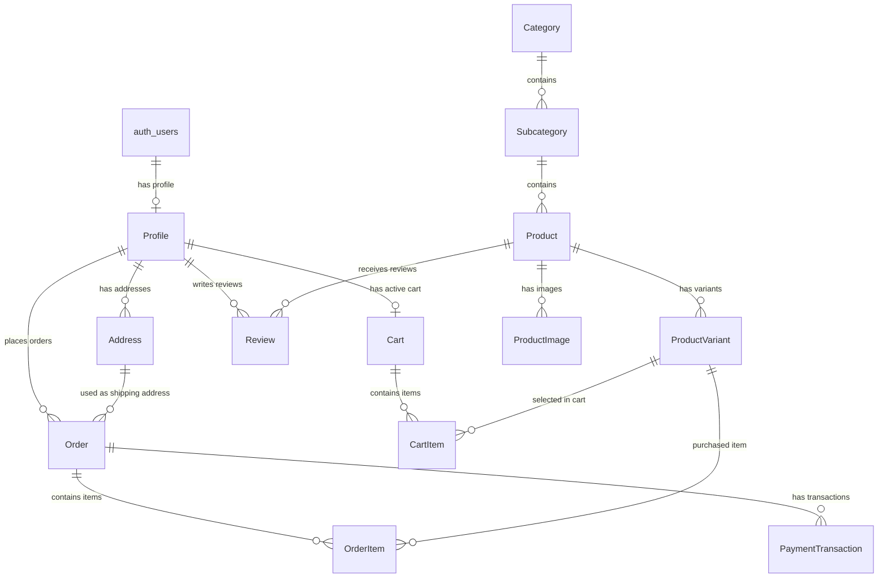

# 3. Database Schema Design (Prisma & Supabase)

## 3.1 Entity-Relationship Diagram (ERD)



---

## 3.2 Complete Prisma Schema Blueprint (`schema.prisma`)

```prisma
datasource db {
  provider  = "postgresql"
  url       = env("DATABASE_URL")
  directUrl = env("DIRECT_URL")
}

generator client {
  provider = "prisma-client-js"
}

enum Role {
  CUSTOMER
  ADMIN
}

enum OrderStatus {
  PENDING_PAYMENT
  PAID
  PROCESSING
  SHIPPED
  DELIVERED
  CANCELLED
  REFUNDED
}

enum PaymentStatus {
  PENDING
  COMPLETED
  FAILED
  REFUNDED
}

enum PaymentProvider {
  STRIPE
  RAZORPAY
  CASH_ON_DELIVERY
}

model Profile {
  id        String    @id @default(uuid()) @db.Uuid
  userId    String    @unique @db.Uuid // Foreign key linking to Supabase auth.users.id
  email     String    @unique
  fullName  String?
  avatarUrl String?
  phone     String?
  role      Role      @default(CUSTOMER)
  createdAt DateTime  @default(now())
  updatedAt DateTime  @updatedAt

  addresses Address[]
  cart      Cart?
  orders    Order[]
  reviews   Review[]

  @@map("profiles")
}

model Address {
  id           String   @id @default(uuid()) @db.Uuid
  profileId    String   @db.Uuid
  recipient    String
  street       String
  city         String
  state        String
  postalCode   String
  country      String
  isDefault    Boolean  @default(false)
  createdAt    DateTime @default(now())
  updatedAt    DateTime @updatedAt

  profile      Profile  @relation(fields: [profileId], references: [id], onDelete: Cascade)
  orders       Order[]

  @@map("addresses")
}

model Category {
  id          String        @id @default(uuid()) @db.Uuid
  name        String        @unique
  slug        String        @unique
  description String?
  imageUrl    String?
  createdAt   DateTime      @default(now())
  updatedAt   DateTime      @updatedAt

  subcategories Subcategory[]

  @@map("categories")
}

model Subcategory {
  id          String   @id @default(uuid()) @db.Uuid
  categoryId  String   @db.Uuid
  name        String
  slug        String   @unique
  description String?
  createdAt   DateTime @default(now())
  updatedAt   DateTime @updatedAt

  category    Category  @relation(fields: [categoryId], references: [id], onDelete: Cascade)
  products    Product[]

  @@map("subcategories")
}

model Product {
  id            String   @id @default(uuid()) @db.Uuid
  subcategoryId String   @db.Uuid
  title         String
  slug          String   @unique
  description   String
  basePrice     Decimal  @db.Decimal(10, 2)
  isFeatured    Boolean  @default(false)
  isActive      Boolean  @default(true)
  createdAt     DateTime @default(now())
  updatedAt     DateTime @updatedAt

  subcategory   Subcategory      @relation(fields: [subcategoryId], references: [id])
  variants      ProductVariant[]
  images        ProductImage[]
  reviews       Review[]

  @@index([subcategoryId])
  @@index([title, description])
  @@map("products")
}

model ProductVariant {
  id         String   @id @default(uuid()) @db.Uuid
  productId  String   @db.Uuid
  sku        String   @unique
  name       String   // e.g. "Red / XL"
  price      Decimal  @db.Decimal(10, 2)
  stockCount Int      @default(0)
  attributes Json     // e.g. { "color": "Red", "size": "XL" }
  createdAt  DateTime @default(now())
  updatedAt  DateTime @updatedAt

  product    Product     @relation(fields: [productId], references: [id], onDelete: Cascade)
  cartItems  CartItem[]
  orderItems OrderItem[]

  @@index([productId])
  @@map("product_variants")
}

model ProductImage {
  id        String   @id @default(uuid()) @db.Uuid
  productId String   @db.Uuid
  url       String
  altText   String?
  isPrimary Boolean  @default(false)
  sortOrder Int      @default(0)
  createdAt DateTime @default(now())

  product   Product  @relation(fields: [productId], references: [id], onDelete: Cascade)

  @@map("product_images")
}

model Cart {
  id        String   @id @default(uuid()) @db.Uuid
  profileId String?  @unique @db.Uuid
  createdAt DateTime @default(now())
  updatedAt DateTime @updatedAt

  profile   Profile?   @relation(fields: [profileId], references: [id], onDelete: Cascade)
  items     CartItem[]

  @@map("carts")
}

model CartItem {
  id               String   @id @default(uuid()) @db.Uuid
  cartId           String   @db.Uuid
  productVariantId String   @db.Uuid
  quantity         Int      @default(1)
  createdAt        DateTime @default(now())
  updatedAt        DateTime @updatedAt

  cart             Cart           @relation(fields: [cartId], references: [id], onDelete: Cascade)
  productVariant   ProductVariant @relation(fields: [productVariantId], references: [id], onDelete: Cascade)

  @@unique([cartId, productVariantId])
  @@map("cart_items")
}

model Order {
  id             String      @id @default(uuid()) @db.Uuid
  orderNumber    String      @unique
  profileId      String      @db.Uuid
  addressId      String      @db.Uuid
  status         OrderStatus @default(PENDING_PAYMENT)
  subtotal       Decimal     @db.Decimal(10, 2)
  tax            Decimal     @db.Decimal(10, 2)
  shippingCost   Decimal     @db.Decimal(10, 2)
  totalAmount    Decimal     @db.Decimal(10, 2)
  trackingNumber String?
  createdAt      DateTime    @default(now())
  updatedAt      DateTime    @updatedAt

  profile        Profile              @relation(fields: [profileId], references: [id])
  shippingAddress Address             @relation(fields: [addressId], references: [id])
  items          OrderItem[]
  transactions   PaymentTransaction[]

  @@index([profileId])
  @@index([orderNumber])
  @@map("orders")
}

model OrderItem {
  id               String   @id @default(uuid()) @db.Uuid
  orderId          String   @db.Uuid
  productVariantId String   @db.Uuid
  unitPrice        Decimal  @db.Decimal(10, 2)
  quantity         Int
  totalPrice       Decimal  @db.Decimal(10, 2)

  order            Order          @relation(fields: [orderId], references: [id], onDelete: Cascade)
  productVariant   ProductVariant @relation(fields: [productVariantId], references: [id])

  @@map("order_items")
}

model PaymentTransaction {
  id            String          @id @default(uuid()) @db.Uuid
  orderId       String          @db.Uuid
  provider      PaymentProvider
  transactionId String          @unique
  status        PaymentStatus
  amount        Decimal         @db.Decimal(10, 2)
  rawResponse   Json?
  createdAt     DateTime        @default(now())

  order         Order           @relation(fields: [orderId], references: [id], onDelete: Cascade)

  @@map("payment_transactions")
}

model Review {
  id        String   @id @default(uuid()) @db.Uuid
  productId String   @db.Uuid
  profileId String   @db.Uuid
  rating    Int      // 1 to 5
  comment   String?
  createdAt DateTime @default(now())
  updatedAt DateTime @updatedAt

  product   Product  @relation(fields: [productId], references: [id], onDelete: Cascade)
  profile   Profile  @relation(fields: [profileId], references: [id], onDelete: Cascade)

  @@unique([productId, profileId])
  @@map("reviews")
}
```
